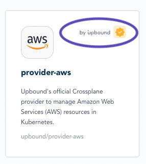
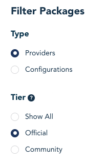

Upbound creates, maintains and supports a set of Crossplane providers called *official providers*.  

## Find official providers
Identify official providers in the marketplace with the `by Upbound` gold seal.

{{}}

Also find official providers by filtering a [search in the marketplace](https://marketplace.upbound.io/providers?tier=official) to just `Official`.

{{}}

## Install an official provider
The [Upbound Marketplace](https://marketplace.upbound.io/) hosts official providers. 

### Install the provider resource
Install a provider with the creating a `Provider` Kubernetes resource with the [Up command-line]() or manually.




Install the provider directly into Kubernetes using the Up command-line.  
Provide the package source of the provider to install. This example installs the [AWS official provider version 0.17.0](https://marketplace.upbound.io/providers/upbound/provider-aws/v0.17.0).
```shell {copy-lines="all"}
up controlplane \
provider install \
xpkg.upbound.io/upbound/provider-aws:v0.17.0
```



Create a `kind: Provider` Kubernetes manifest.  

Provide the `spec.package` location of the official provider from the Upbound Marketplace listing. 

This example installs the [AWS official provider version 0.17.0](https://marketplace.upbound.io/providers/upbound/provider-aws/v0.17.0).

```yaml
apiVersion: pkg.crossplane.io/v1
kind: Provider
metadata:
    name: provider-aws
spec:
  package: xpkg.upbound.io/upbound/provider-aws:v0.17.0
  packagePullSecrets:
    - name: package-pull-secret
```




Find provider specific instructions and configurations in their individual documentation pages within the [Upbound Marketplace](https://marketplace.upbound.io/providers).
## Versions and releases
Official providers have two relevant release numbers:
* Provider release, for example, `provider-aws:v0.17.0`
* Custom Resource Definition (*CRD*) API version, for example `v1beta1`

### Provider releases
Upbound releases new providers to provide bug fixes and enhancements. Provider versions follow standard semantic versioning (*semver*) standards of `<major>`.`<minor>`.`<patch>` numbering.

**Major version** changes have significant changes to provider behavior or breaking changes to general availability CRD APIs.  

**Minor version** changes expand provider capabilities or create breaking changes to `alpha` or `beta` CRD APIs. Minor versions never change general availability CRD APIs.

**Patch version** changes are bug fixes. Provider capabilities and CRD APIs aren't changed between patch versions. 

<!--
### Custom resource definition API versions
The CRDs contained within an official provider follow the standard Kubernetes API versioning and deprecation policy. 

* `v1alpha` - CRDs under `v1alpha` haven't passed through full Upbound quality assurance. `v1alpha1` providers are for testing and experimentation and aren't intended for production deployment.

* `v1beta1` - This identifies a qualified and tested CRD. 
Upbound attempts to ensure a stable CRD API but may require breaking changes in future versions. `v1beta1` may be missing endpoints or settings related to the provider resource.

* `v1beta2` - Like `v1beta1` CRDs all `v1beta2` providers are fully qualified and tested. `v1beta2` contain more features or breaking API changes from `v1beta1`. 

* `v1` - CRDs that reach a `v1` API version have fully defined APIs. Upbound doesn't make breaking API changes until the next provider API version. 
-->

## Support
Official providers are available to all paid Upbound customers. Support for official providers follows the same support model for other Upbound components. 

More information is available on the [support page]().

<!-- TODO
## Coverage

-->